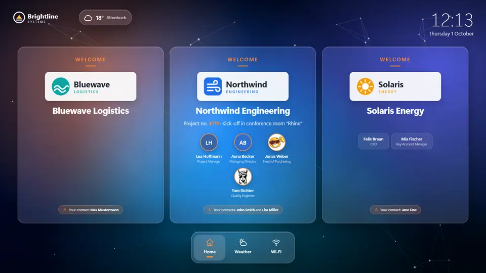
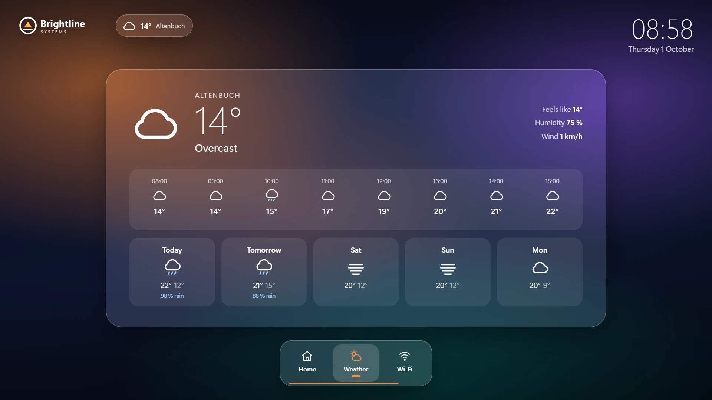
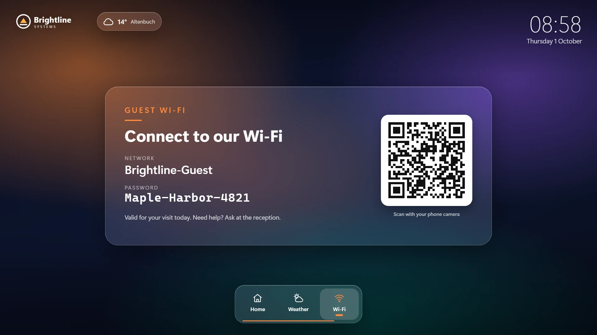
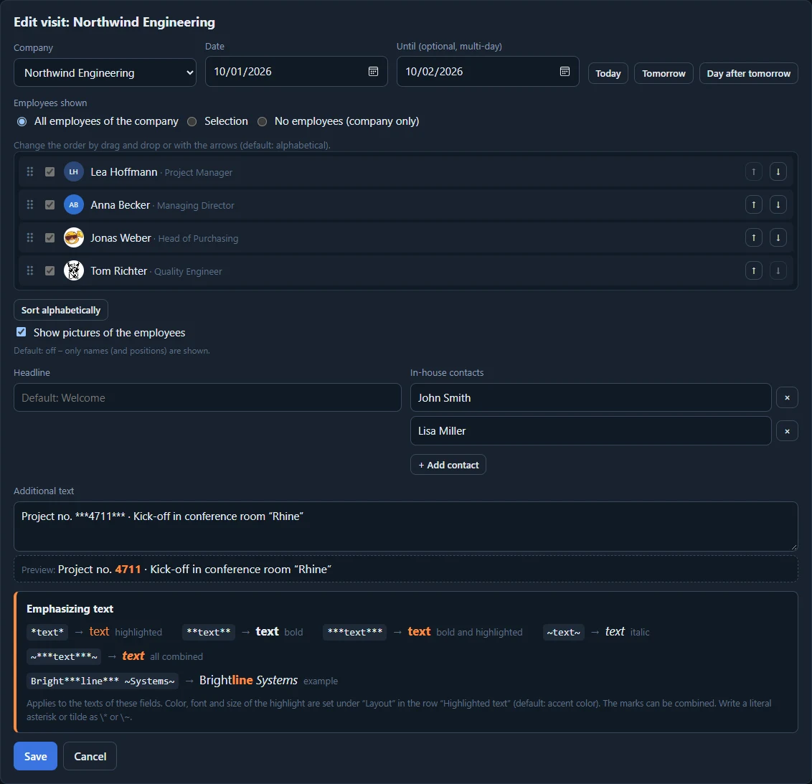
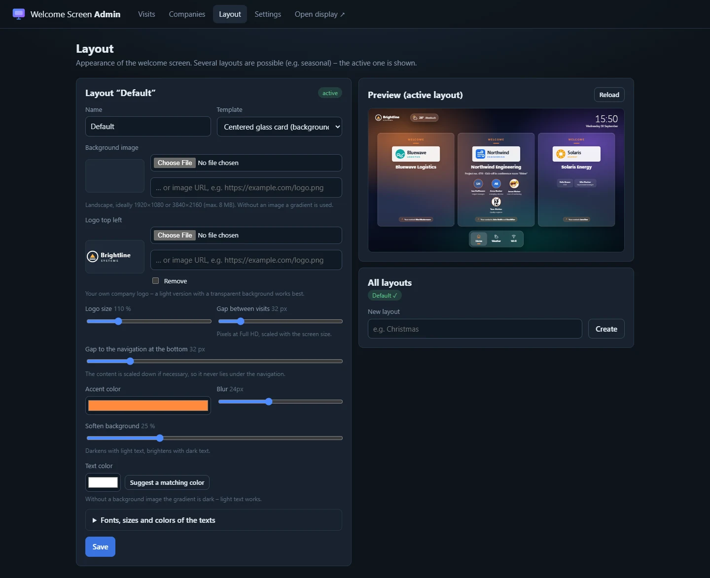

# Company Welcome Screen

A welcome screen for your reception area. When a company visits, the screen automatically shows its logo, its name and
the employees who are coming – on exactly the days of the visit. Several visits on the same day are shown side by side.
Around it: your own logo, the time, the weather and your guest Wi-Fi.



<p>
  
  
</p>

Everything is maintained in a web-based **admin area**, via a **REST API** or in plain language via the **MCP server**
from Claude and other AI assistants (*"Northwind is visiting tomorrow with Anna and Jonas"*).

<p>
  
  
</p>

## Features

- **Automatic greeting** on the days of a visit – also multi-day, with all, selected or no employees, in an order set
  by drag and drop, with in-house contacts and an additional text (e.g. project number).
- **Several visits side by side** as tiles of equal height whose sections line up; the content is zoomed out if
  necessary, so it never slides under the navigation.
- **Employee pictures** – own photo, a picture from the picture pool or initials in a color of your choice – switched
  on per visit (default: names only).
- **Weather** (Open-Meteo, no API key) and **guest Wi-Fi** with QR code.
- **Emphasized text** – parts of the free texts can be highlighted in the accent color, bold and/or italic, e.g.
  `Bright***line*** ~Systems~`.
- **Layouts** – background image or **background video** (muted loop with a soft cross-fade), own logo and its size,
  colors, glass effect, spacing, and font, size and color of every text element. Twelve open-source fonts are shipped (no external font services). Several layouts, e.g.
  seasonal.
- **Images by upload or URL** everywhere, **REST API** and **MCP server**, **English and German**, **SQLite** storage
  (one database file; background videos as files next to it).

## Quick start

Requires Node.js 20 or newer.

```bash
npm install
npm run seed      # optional demo data
npm start         # display: http://localhost:3000   admin: http://localhost:3000/admin
```

On the first start – unless `ADMIN_TOKEN` is set – an admin token is generated, saved to `data/.admin-token` and printed
to the console. Use it to sign in to the admin area.

With Docker:

```bash
ADMIN_TOKEN=my-secret-token docker compose up -d --build
```

## Documentation

The full documentation with screenshots is in the **[Wiki](https://github.com/boexler/company-welcomescreen/wiki)**:

- [Installation](https://github.com/boexler/company-welcomescreen/wiki/Installation) – Docker, Portainer, environment variables, updates
- [Welcome Screen](https://github.com/boexler/company-welcomescreen/wiki/Welcome-Screen) – what the display shows, kiosk setup, portrait screens
- [Visits](https://github.com/boexler/company-welcomescreen/wiki/Visits) · [Companies and Employees](https://github.com/boexler/company-welcomescreen/wiki/Companies-and-Employees) · [Layouts](https://github.com/boexler/company-welcomescreen/wiki/Layouts) · [Settings](https://github.com/boexler/company-welcomescreen/wiki/Settings)
- [REST API](https://github.com/boexler/company-welcomescreen/wiki/REST-API) · [MCP Server](https://github.com/boexler/company-welcomescreen/wiki/MCP-Server)
- [Languages](https://github.com/boexler/company-welcomescreen/wiki/Languages) · [Data and Backup](https://github.com/boexler/company-welcomescreen/wiki/Data-and-Backup)

The screenshots show a fictional demo setup; all companies, people and the Wi-Fi are made up. The background animation
was generated for this project and contains no third-party material.

## Licenses

The shipped fonts in `public/fonts` (from Google Fonts) are licensed under the SIL Open Font License 1.1 or the Apache
License 2.0.
